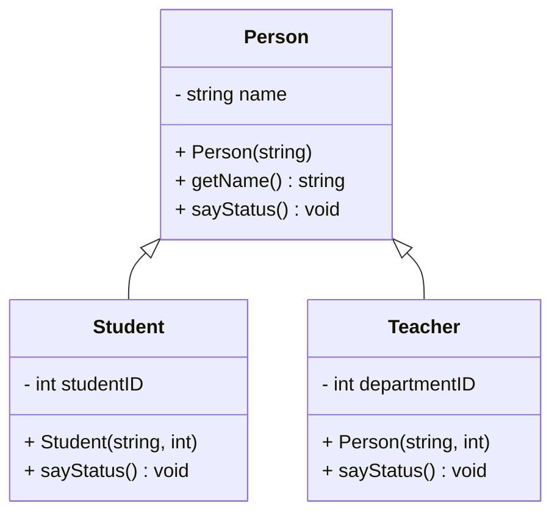

# Tehtävän luokkakaavio

```mermaid
classDiagram
    class Person{
        - string name
        + Person(string)
        + getName() string
        + sayStatus() void
    }
    class Student{
        - int studentID
        + Student(string, int)
        + sayStatus() void
    }
    class Teacher{
        - int departmentID
        + Person(string, int)
        + sayStatus() void
    }
    Person <|-- Student
    Person <|-- Teacher
```